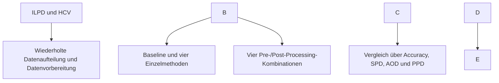

# Kombinationseffekte ausgewählter Pre- und Post-Processing-Fairnessmethoden bei der Lebererkrankungsvorhersage

**Art:** Bachelorarbeit<br>
**Autor:** Anton Schmidt<br>
**Erstprüfer:** Prof. Dr. Stefan Lessmann<br>
**Zweitprüfer:** Prof. Dr. Georg Tafner




## Inhaltsverzeichnis

* [Kurzfassung](#kurzfassung)
* [Arbeiten mit dem Repository](#arbeiten-mit-dem-repository)

  * [Abhängigkeiten](#abhängigkeiten)
  * [Einrichtung](#einrichtung)
* [Reproduktion der Ergebnisse](#reproduktion-der-ergebnisse)

  * [Trainingscode](#trainingscode)
  * [Evaluationscode](#evaluationscode)
  * [Vortrainierte Modelle](#vortrainierte-modelle)
* [Ergebnisse](#ergebnisse)
* [Projektstruktur](#projektstruktur)

## Kurzfassung

Diese Bachelorarbeit untersucht, wie sich die sequenzielle Kombination ausgewählter Pre- und Post-Processing-Fairnessmethoden auf gruppenbezogene Fairness und Vorhersagegüte bei der Lebererkrankungsvorhersage auswirkt. Als Datengrundlage dienen das Indian Liver Patient Dataset (ILPD) und der HCV-Datensatz. Das Geschlecht dient als sensibles Merkmal. Ein Random Forest bildet die Baseline. Reweighing und Correlation Remover werden als Pre-Processing-Methoden, Equalized Odds und Threshold Optimization als Post-Processing-Methoden jeweils einzeln und in vier Kombinationen untersucht. Die Bewertung erfolgt über Accuracy, Statistical Parity Difference (SPD), Average Odds Difference (AOD) und Predictive Parity Difference (PPD) anhand von 100 wiederholten Durchläufen mit festgelegten Zufallsseeds.


Die Ergebnisse zeigen datensatz- und metrikabhängige Wirkungen. Im ILPD treten stärkere Ausgangsdisparitäten und deutlichere Methodeneffekte als im HCV-Datensatz auf. Verbesserungen von SPD und AOD gehen nicht durchgehend mit einer Verbesserung der PPD einher und können mit Einbußen bei der Accuracy verbunden sein. Auch die Kombinationen keine signifikante Fairnessverbesserung.

**Schlüsselwörter:** Algorithmische Fairness, Lebererkrankungsvorhersage, Pre-Processing, Post-Processing, Random Forest, ILPD, HCV

**Volltext:** `\[Link zum veröffentlichten Volltext eintragen]`

## Arbeiten mit dem Repository

### Abhängigkeiten

Für die Ausführung wurde Python 3.12.4 verwendet. Die benötigten Python-Pakete und ihre Versionen sind in `requirements.txt` festgehalten:

```text
pandas==2.2.3
numpy==2.2.5
scipy==1.15.3
scikit-learn==1.6.1
aif360==0.6.1
fairlearn==0.12.0
openpyxl==3.1.5
```

Zusätzlich wird eine Jupyter-kompatible Umgebung benötigt, beispielsweise JupyterLab oder Visual Studio Code mit Jupyter-Erweiterung.

### Einrichtung

1. Repository klonen und in den Projektordner wechseln:

```bash
   git clone <URL-DIESES-REPOSITORIES>
   cd fairness-method-combinations-liver-disease
   ```

2. Virtuelle Python-Umgebung erstellen:

```bash
   python -m venv .venv
   ```

3. Umgebung aktivieren.

   Unter Windows PowerShell:

```powershell
   .\\.venv\\Scripts\\Activate.ps1
   ```

   Unter macOS oder Linux:

```bash
   source .venv/bin/activate
   ```

4. Abhängigkeiten installieren:

```bash
   python -m pip install --upgrade pip
   python -m pip install -r requirements.txt
   ```

5. Das Notebook in einer Jupyter-kompatiblen Umgebung öffnen.

## Reproduktion der Ergebnisse

1. Die Einrichtungsschritte aus dem vorherigen Abschnitt ausführen.
2. Prüfen, ob die beiden unveränderten Rohdateien unter den folgenden Pfaden vorliegen:

```text
   data/Indian Liver Patient Dataset (ILPD).csv
   data/hcvdat0.csv
   ```

3. `src/Bachelorarbeit.ipynb` öffnen.
4. Den Kernel neu starten und sämtliche Zellen in ihrer vorgegebenen Reihenfolge ausführen.
5. Nach erfolgreicher Ausführung befindet sich die Ergebnisdatei unter `results/fairness\_results.xlsx`.

Die Versuchsreihe verwendet 100 festgelegte Zufallsseeds von 42 bis 141. Die Rohdateien werden nicht verändert. Weitere Angaben zu Herkunft, Lizenz und Prüfsummen der Datensätze enthält `data/README.md`.

### Trainingscode

Das Training aller Modelle erfolgt in `notebooks/Bachelorarbeit.ipynb`. Für jeden Durchlauf wird ein neuer Random Forest trainiert. Das Notebook führt die Baseline, die vier Einzelmethoden und die vier Kombinationen aus Pre- und Post-Processing aus.

### Evaluationscode

Die Evaluation ist ebenfalls vollständig in `notebooks/Bachelorarbeit.ipynb` enthalten. Das Notebook berechnet gruppenspezifische Klassifikationsraten, Accuracy, SPD, AOD und PPD, aggregiert die Ergebnisse über alle Durchläufe und bestimmt die Kombinationseffekte gegenüber der jeweils besten Einzelmethode.

### Vortrainierte Modelle

Es werden keine vortrainierten Modelle bereitgestellt oder benötigt. Sämtliche Modelle und Post-Processing-Komponenten werden bei der Ausführung des Notebooks neu trainiert beziehungsweise angepasst.

## Ergebnisse

Die vollständigen Ergebnistabellen werden in `results/fairness\_results.xlsx` gespeichert. Die Arbeitsmappe enthält folgende Tabellenblätter:

* `Gruppenmetriken`
* `Fairnessmetriken`
* `Kombinationseffekte`
* `Kombinationseffekte\_Laeufe`

Die ersten beiden Tabellenblätter dokumentieren die aggregierten Gruppen- und Fairnessmetriken. Die letzten beiden enthalten die zusammengefassten Kombinationseffekte sowie die zugrunde liegenden Werte der einzelnen Durchläufe.

## Projektstruktur

```text
.
├── README.md
├── requirements.txt
├── .gitignore
├── data
│   ├── README.md
│   ├── Indian Liver Patient Dataset (ILPD).csv
│   └── hcvdat0.csv
├── src
│   └── fairness-method-combinations-liver-disease.ipynb
└── results
    └── fairness_results.xlsx
```

